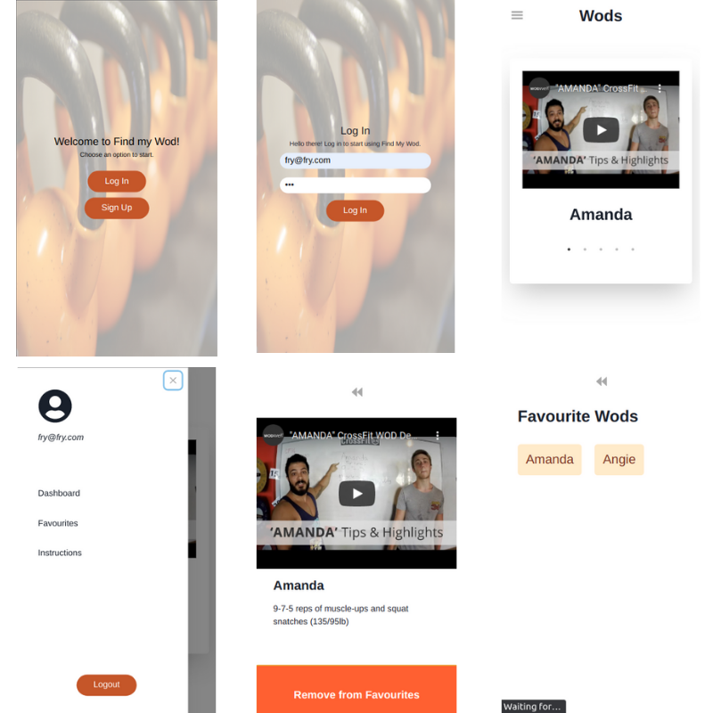

# **Find My Wod - Front-End**
# Final Capstone Project.
This is a solo project at the end of the Microverse Main Technical Curriculum. It's a real-world-like project, built with business specifications to improve and test the achievement of technical and soft skills gained during the program. The technical requirements of this front-end project are:
 
1. The project is a mobile web app
2. Use React for the front-end
3. Routes for each of the screens, so the user can easily go back and forward
4. Use redux to store info used across the app
5. Project deployed and accessible online
 
## **Context of the chosen theme**
A *WOD* (Workout of the Day) is a set of modalities that crossfit coaches use to put you through heavy exercises on any given day. It usually is a set of movements that you should finish at a specific time or in a certain number of rounds.  
 
There are a number of specific *WODs*, that are well-acknowledged among the athletes. Example:
 
**Murph**:
For Time
1 mile Run
100 Pull-Ups
200 Push-Ups
300 Air Squats
1 mile Run
All with a Weight Vest (20/14 lb)
 
**Annie**: 50-40-30-20-10 Reps For Time of
Double-Unders and Sit-Ups
 
Athletes usually record their favourites *WODs* and try to beat their best time.
 
This app can help the athletes manage their favourite *WODs*.
## **Built With**
- React&Redux
- Chakra
- Axios
- JWT
- Netlify
## **Examples**
You can access the project here:
[Find My Wod](https://xenodochial-shockley-55c19b.netlify.app/)
 

 

 
## **Getting Started**
 
This application is the front-end used with the project [Find My Wod - Back-end](https://github.com/carlosveigadev/find-my-wod-backend)
Clone the repository by clicking on "Clone or Download" and copy the given link. In your terminal, go to the folder where you want the project to be and use the following command:
`git clone https://github.com/carlosveigadev/find-my-wod-frontend.git`
After that, open the folder with the code editor of your choice and follow the steps below.
## **Setting up the necessary packages:**
**Make sure you have [Yarn](https://yarnpkg.com/) installed in your machine.**
**Open the terminal and go to the folder of the game and run the following commands:**  
`yarn install`  
`yarn start`  

### **Warning:**
If you want to try this project with the back-end project as your localhost, do not forget to update the URL variable inside `src/api-requests/index.js` to the back-end server URL generated (usually localhost:3001)
 
 
**Those commands will ensure you installed the proper packages required and start the server locally, usually at localhost:3000**
## **Running Jest Tests**
**To verify the Jest test, run the command:** 
`yarn test`
## **Author**
👤 **Carlos Veiga**
- [Github](https://github.com/wrakc)
- [Twitter](https://twitter.com/carlosveig)
- [Linkedin](https://linkedin.com/chveiga)
## 🤝 **Contributing**
Contributions, issues, and feature requests are welcome!
Feel free to check the [issues page](https://github.com/carlosveigadev/find-my-wod-frontend/issues).
## **Show your support**
Give a ⭐️ if you like this project!
## **Acknowledgments**
- Microverse for the opportunity;
- The Minskins for the support.
- Design inspired by Alexey Savitskiy
[@behance](https://www.behance.net/gallery/37706679/Circle-(Landing-page-Dashboard-Mobile-App))
- Image from [PixBay](https://pixabay.com/photos/dumbell-weights-gym-fitness-5237138/)
## 📝 **License**
This project is [MIT](LICENSE) licensed.

